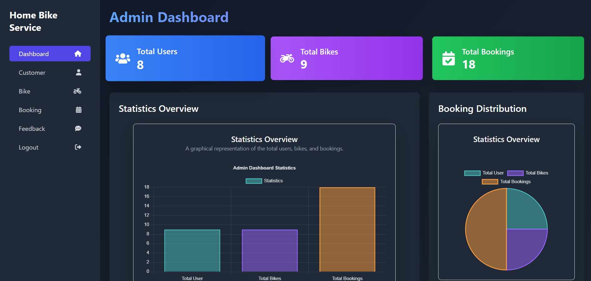
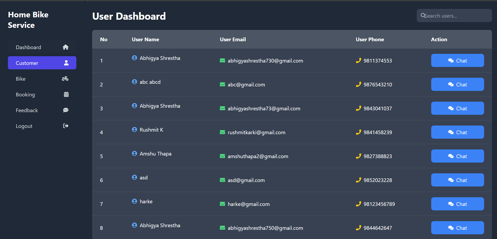
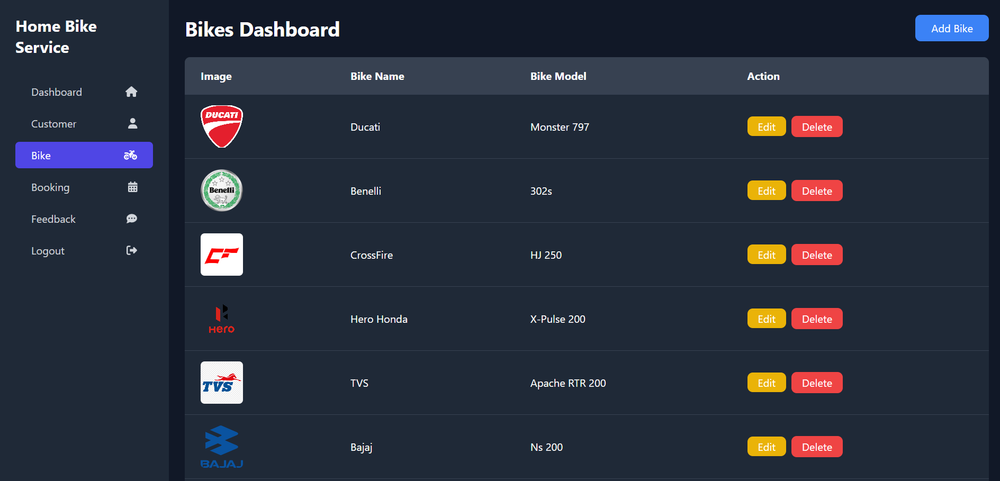
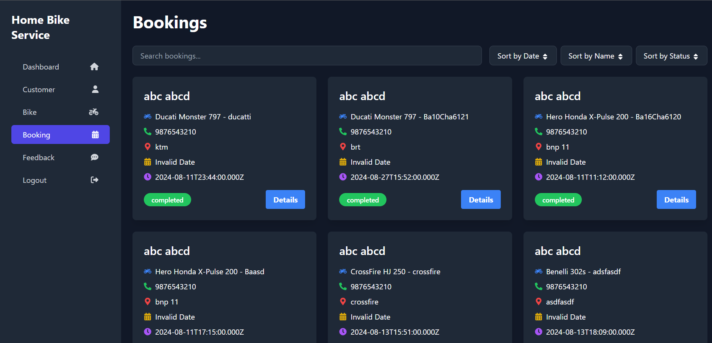
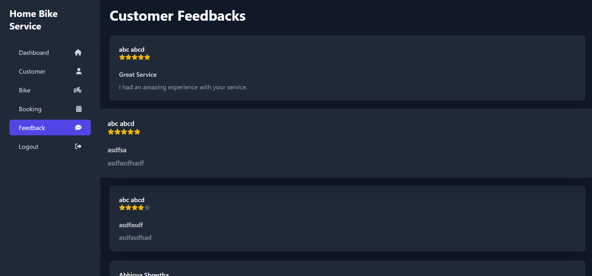

# Home Bike Service – Frontend

## Introduction

The exponential growth of on-demand services has revolutionized how consumers
access essential services like bike repairs. The "Home Bike Service" app is a
modern solution that allows customers to schedule bike maintenance services with
mechanics traveling directly to their location. This document outlines the app's
core features, design patterns, state management, and security considerations,
providing a comprehensive overview of its development and functionality.

**YouTube link:** [Insert Link Here]

## Features

### Admin Role

- **Admin Dashboard**: A centralized control panel for managing app
  functionalities, user data, and service requests.
- **User Management**: Manage user accounts, including editing details, viewing
  service history, and deleting accounts.
- **Chat Management**: Oversee and moderate chat interactions between users and
  mechanics.
- **Bike Update Management**: Update bike details, including available services,
  pricing, and repair statuses.
- **Review & Rating Management**: View and manage user reviews and ratings to
  ensure quality control.

### User Role

- **Bike Selection**: Select your bike model and view available services
  tailored to your bike.
- **Booking**: Book bike services at your preferred time and location.
- **Profile Management**: Manage your profile details, view booking history, and
  update personal information.
- **Contact Us**: Access various ways to contact customer support for
  assistance.
- **Search**: Search for services, mechanics, and more within the app.
- **Payment**: Secure payment gateway integration for service payments.
- **Chat**: Real-time chat feature for communication with mechanics or customer
  support.

## Technologies

-  **React.js**: Core frontend library
  for building the user interface.
- **CSS**: For styling components and enhancing visual appeal.
-  **Axios**: For making HTTP requests to
  interact with the backend API.
-  **React Toastify**:
  For displaying alerts and notifications within the application.
- **MongoDB**: Used as the database to store and manage user data, bike details,
  and transaction records.

## Future Works

- **Tracking**: Implement real-time tracking for mechanics en route to service
  locations.
- **Notification**: Add push notifications to keep users informed about booking
  status, mechanic arrival, and more.
- **Advanced UI**: Continuously improve the user interface for a more intuitive
  and visually appealing experience.

## Challenges

- **API Integration**: Ensure seamless integration of various APIs for robust
  data synchronization and error handling.
- **State Management**: Efficiently handle state within the app, particularly in
  complex scenarios involving user sessions and dynamic data.
- **Payment Integration**: Implement and maintain secure and reliable payment
  processing systems.

## Environment Variables

- `REACT_APP_API_URL`: The base URL for the backend API.
- `REACT_APP_GOOGLE_CLIENT_ID`: Google Client ID for authentication.
- `REACT_APP_CHAT_SERVICE_URL`: URL for the chat service used for communication.
- `REACT_APP_PET_MATCHING_SERVICE_URL`: URL for the AI-based pet matching
  service (if applicable).
- `REACT_APP_LOCATION_SERVICE_URL`: URL for the location-based filtering service
  (if applicable).

**Backend link:**
[GitHub Repository](https://github.com/st6003/backend-seca-AbhigyaShrestha2060.git)

## Authors

- Abhigya Shrestha

## Appendix

[Additional information, diagrams, or documentation can be included here.]
=======
Home Bike Service – Frontend
Introduction
The exponential growth of on-demand services has revolutionized the way consumers access essential services like bike repairs. The "Home Bike Service" app is a modern solution that enables customers to schedule bike maintenance services, with mechanics traveling directly to their location. This document outlines the app's core features, design patterns, state management, and security considerations, providing an in-depth overview of its development and functionality.

YouTube link: 

Features

Admin Role
•	Admin Dashboard: Centralized control panel for managing app functionalities, user data, and service requests.
•	User Management: Features for managing user accounts, including editing user details, viewing service history, and deleting accounts.
•	Chat Management: Overseeing and moderating chat interactions between users and mechanics.
•	Bike Update Management: Admin can update bike details, including available services, pricing, and repair statuses.
•	Review & Rating Management: Admin can view and manage user reviews and ratings, ensuring quality control.

User Role
•	Bike Selection: Users can select their bike model and view available services tailored to their bike.
•	Booking: Allows users to book bike services at their preferred time and location.
•	Profile Management: Users can manage their profile details, view their booking history, and update personal information.
•	Contact Us: Provides users with various ways to contact customer support for assistance.
•	Search: Users can search for services, mechanics, and more within the app.
•	Payment: Secure payment gateway integration for users to pay for services.
•	Chat: Real-time chat feature for users to communicate with mechanics or customer support.

Technologies
•	React.js: Core frontend library for building the user interface.
•	CSS: For styling components and enhancing visual appeal.
•	Axios: Utilized for making HTTP requests to interact with the backend API.
•	React Toastify: For displaying alerts and notifications within the application.
•	MongoDB: Employed as the database to store and manage user data, bike details, and transaction records.

Future Works
•	Tracking: Implementation of real-time tracking for mechanics en route to service locations.
•	Notification: Enhancing the app with push notifications to keep users informed about booking status, mechanic arrival, and more.
•	Advanced UI: Continuous improvements to the user interface for a more intuitive and visually appealing experience.

Challenges
•	API Integration: Seamless integration of various APIs ensuring robust data synchronization and error handling.
•	State Management: Efficient handling of state within the app, particularly in complex scenarios involving user sessions and dynamic data.
•	Payment Integration: Implementation and maintenance of secure and reliable payment processing systems.

Environment Variables
Backend link: https://github.com/st6003/backend-seca-AbhigyaShrestha2060.git

Authors
Abhigya Shrestha

Appendix

